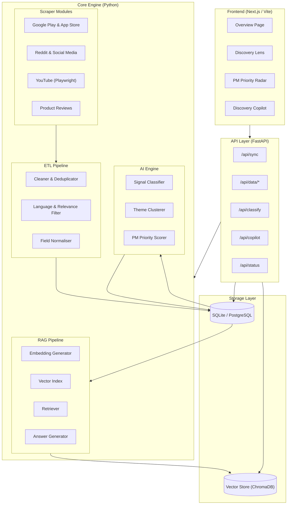
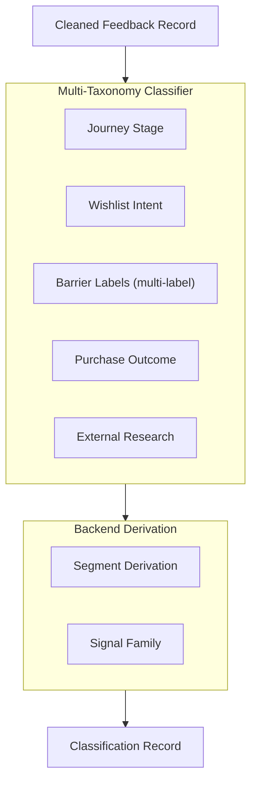
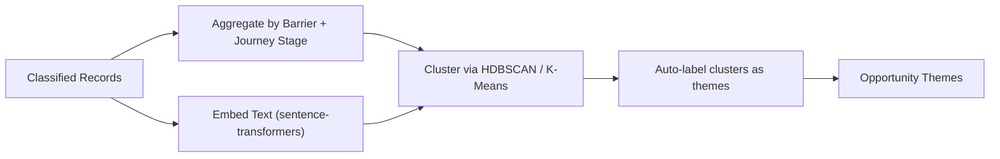

# MyntraPulseAI (Wishlist Discovery Engine)

MyntraPulseAI is a PM Priority Radar and Discovery Lens application built to analyze user feedback, identify core friction groupings (like Price, Fit, Quality, and Comparison), and help Product Managers understand Wishlist-to-Purchase conversion barriers.

---

## 1. System Overview

The **Myntra Wishlist Purchase Discovery Engine** is an AI-powered research workspace that:
1. **Ingests** real public English-language feedback from source categories using a free, open-source toolchain.
2. **Structures** raw feedback into standardised records via an ETL pipeline.
3. **Classifies** each record against multi-dimensional taxonomies (journey stage, wishlist intent, purchase barriers, external research, segments).
4. **Clusters** classified records into opportunity themes and ranks them with the **PM Priority Score**.
5. **Presents** findings through interactive output pages (Overview, Discovery Lens, PM Priority Radar, Discovery Copilot).

---

## 2. Architecture & High-Level Diagram

This project is separated into a **Backend** (FastAPI) and a **Frontend** (React + Vite).

- **Backend**: Python-based FastAPI server. Uses ChromaDB for Retrieval-Augmented Generation (RAG) and the Groq API (Qwen/LLaMA models) for generating deep qualitative insights.
- **Frontend**: A modern React application built with Vite and styled with Tailwind CSS to visualize feedback themes and provide a conversational copilot interface.



---

## 3. AI Classification & Theme Clustering

The core engine uses advanced AI techniques to categorize raw feedback and cluster it into actionable insights.

### Classification Pipeline

Feedback records are processed through a multi-taxonomy classifier to identify journey stages, intents, barrier labels, and external research channels. The LLM performs prompt-based classification, returning structured JSON which is then further refined by backend logic to derive segments and signal families.



### Theme Clustering

After classification, the engine clusters the records into cohesive **opportunity themes**. These clusters are dynamically formed based on textual embeddings and categorizations.



Each opportunity theme is then scored using a **PM Priority Score**, calculated based on prevalence, severity, metric proximity, cross-source consistency, and addressability.

---

## 4. Getting Started

### Prerequisites
- Python 3.9+
- Node.js 18+

### Running the Backend
1. Navigate to the `backend/` directory.
2. Create and configure your `.env` file with your Groq API keys (`GROQ_API_KEY`, etc.).
3. Install dependencies:
   ```bash
   pip install -r requirements.txt
   ```
4. Start the server:
   ```bash
   python main.py
   ```
   The backend API will be available at `http://localhost:8000`.

### Running the Frontend
1. Navigate to the `frontend/` directory.
2. Install dependencies:
   ```bash
   npm install
   ```
3. Start the development server:
   ```bash
   npm run dev
   ```
   The frontend will be available at `http://localhost:5173`.
